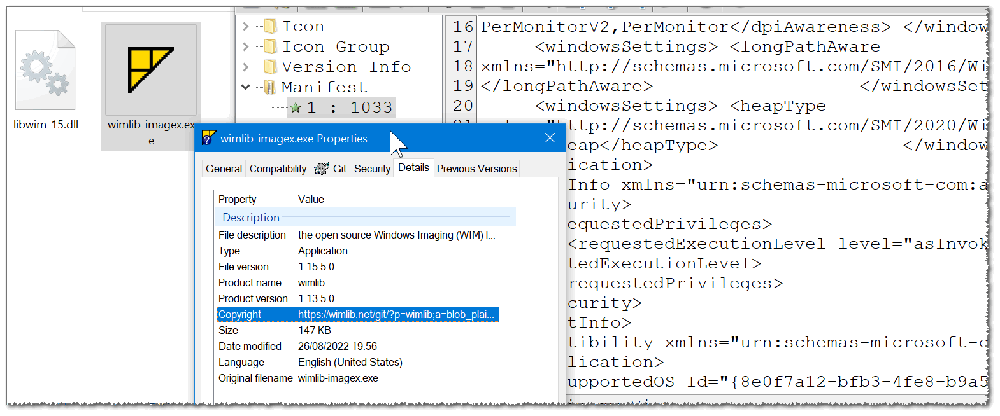

https://github.com/eladkarako/winlib_patched_for_w10_w11/archive/refs/heads/master.zip

 

binary patching to allow allocation of more than 2GB,  
have manifest with Windows 10/11 compatibility segment to allow the application to run without the vista virtualization engine,  
long path awareness (would require a user to opt-in with a registry patch),  
using new segmented heap to allocate memory more efficiently,  
as well as version info and icon.  
most of the job was done using https://github.com/eladkarako/manifest/ and ResourceHacker.  

based on original build from https://wimlib.net/downloads/ .
license is https://wimlib.net/git/?p=wimlib;a=blob_plain;f=COPYING;hb=HEAD

